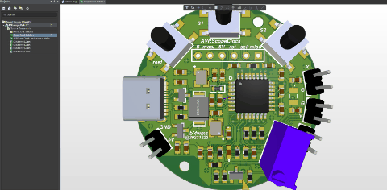

# 👨‍💻 bi4wms | Senior Hardware Systems Architect
### 20+ Years of Engineering Excellence | RF Specialist | Prototype-to-Product Expert

  
  
  
  

---

## 🖼 Project Showcase

  
   
  <i>From 3D Mechanical Modeling to High-Density PCBA Deployment</i>

---

## 📖 Executive Summary
A veteran Systems Architect with over **two decades** of experience in high-complexity electronic systems. I specialize in the **"Mission-Critical"** hardware niche—where high reliability, extreme EMI shielding, and precision motion control are non-negotiable. 

As a **Class B Amateur Radio Operator (BI4WMS)**, I bring a unique "RF-first" perspective to hardware design, ensuring superior signal integrity and wireless performance from the ground up. I bridge the gap between heavy industrial requirements and the agility of modern consumer electronics.

---

## 🛠 Advanced Technical Stack

### 🔌 Hardware Engineering (EDA Master)
* **High-Speed Design:** 20+ years of **Altium Designer**. Expert in 10+ layer HDI, impedance control, and SI/PI (Signal/Power Integrity) analysis.
* **RF & Wireless:** Custom antenna design, SDR (Software Defined Radio) implementation, and RF front-end optimization (HF to Microwave).
* **Power & Motion:** Deep expertise in **VESC** and **SimpleFOC** ecosystems; designing high-current (100A+) motor controllers and battery management systems (BMS).

### 🤖 Robotics & Embedded Systems
* **Architecture:** Multi-sensor fusion (LiDAR, ToF, IMU, Multi-spectral) for Autonomous Mobile Robots (AMR).
* **SoC/MCU:** Expert-level mastery of **STM32**, FPGA-based real-time video processing, and edge computing for IIoT.

### 🏭 Manufacturing & Supply Chain
* **Turnkey Solutions:** Navigating the **Shenzhen/Nanjing supply chain** for PCBA, CNC, and Injection Molding.
* **DFM/DFA:** Designing for high-yield mass production while maintaining **IPC Class 3** standards.

---

## 🏆 Signature Projects

### ⚡ State Grid Corporation of China
* **Role:** Lead Systems Architect
* **Challenge:** Designing electronics to survive in **500kV+ high-voltage environments**.
* **Success:** Developed a ruggedized, EMI-shielded robotic brain that integrates LiDAR and PD sensors, now deployed across national-scale power infrastructure.

### 🏢 Predictive Maintenance for Global Infrastructure
* **Role:** Senior Hardware Lead (For a Leading Global Escalator Brand)
* **Achievement:** Built an end-to-end IIoT sensor network. Implemented edge-AI to process vibration/thermal signatures, reducing downtime by 30% through predictive mechanical fatigue modeling.

### 🚁 Hardware Reconstruction & Reverse Engineering
* **Project: OpenPilot RevoNano**
* **Achievement:** Reconstructed complex 6-layer high-density flight controllers from binary/firmware logic. Optimized the original power rail design to reduce noise floor by 15dB.

### 🚀 Crowdfunding & Market Success
* **Projects: KV4P & SimpleFOC Hardware**
* **Achievement:** Led full-lifecycle development for multiple global crowdfunding hits. Managed everything from "Golden Sample" validation to global logistics for thousands of units.

---

## 📡 Radio & Hardware Aesthetics
> "I view hardware as a synergy of physics and art. My designs prioritize **EMC by design** rather than by patch. Whether it's a shortwave transceiver or an industrial robot, I ensure professional aesthetics through custom silkscreens, ergonomic 3D-designed enclosures, and clean, logical routing."

---

## 🤝 Connect with Me
* **Expertise:** Industrial Robotics, RF Design, Reverse Engineering, Supply Chain Consulting.
* **Email:** [bi4wms@sina.com](mailto:bi4wms@sina.com)
* **Location:** Nanjing, China (Central Hub of Electronics Manufacturing)

---
## 📺 Video Demos & Channel
Check out my hardware in action on my YouTube channel:
▶️ **[Visit BI4WMS YouTube Channel](https://www.youtube.com/@bi4wms862)**

---
